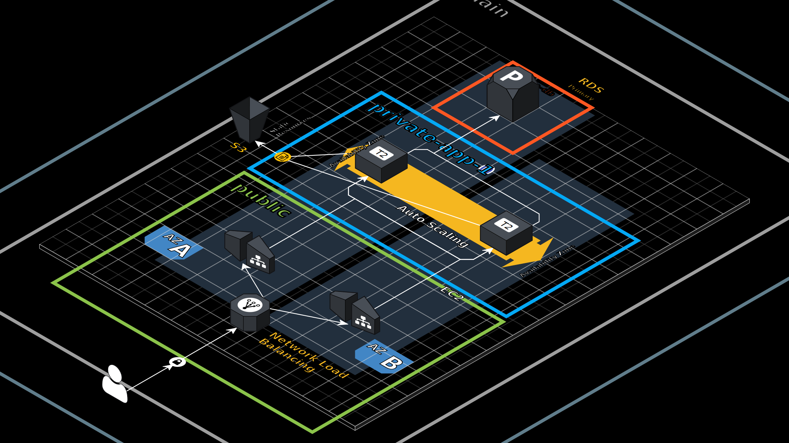

# Three Tier Architecture

AWS project to deploy a three tier architecture with high availability and resilience. The following diagram shows the architecture:

The details of the development are in the following [link](https://mauriciod13.github.io/projects/aws_history_1/)

Note: There a few commits in this repository because the code was in a different repository for privacy.